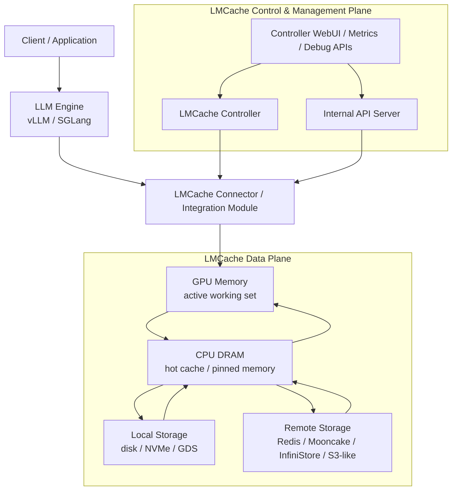
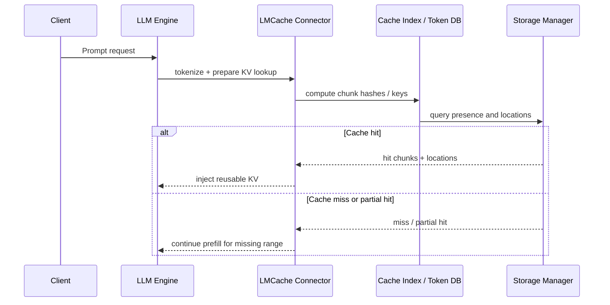
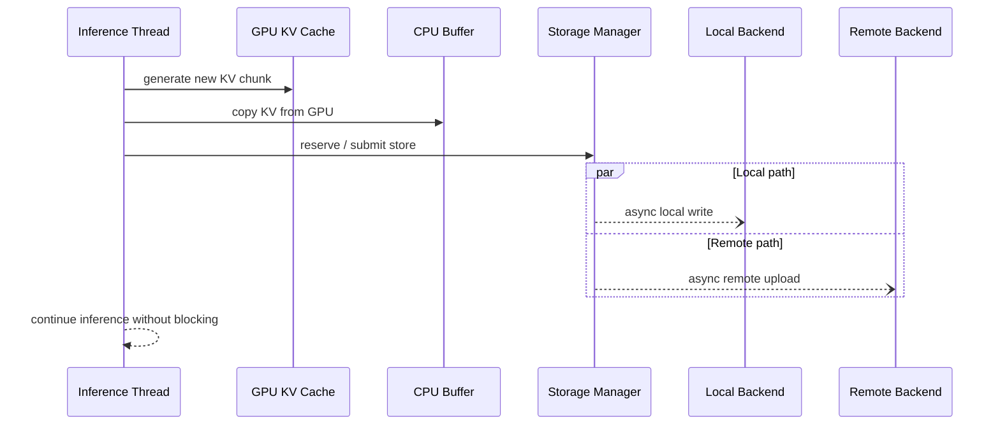
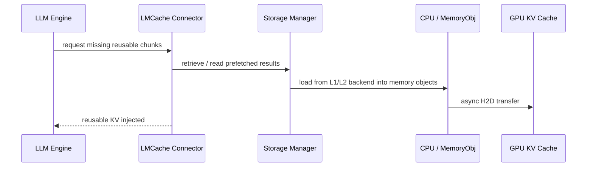

# LMCache 架构文档

## 1. LMCache 项目概览

LMCache 是一个面向 LLM 推理系统的 **KV Cache Layer / Caching Middleware**。它位于推理引擎和存储系统之间，负责识别、存储、搬运与复用 KV cache，从而减少重复 prefill 计算，降低 `TTFT (Time To First Token)`，并提升长上下文和高复用场景下的吞吐率。

从官方描述看，LMCache 的目标不是替代推理引擎，而是给推理引擎增加一个可跨请求、跨进程、跨实例、跨节点复用 KV cache 的中间层。它当前主要集成在 `vLLM`，同时也支持 `SGLang`，并在官方文档中将 `TRT-LLM` 标注为 coming soon。

LMCache 特别适合以下场景：

- 长上下文推理
- RAG
- 多轮对话
- 多实例部署下的重复提示词复用
- Prefill / Decode 分离部署

截至 `2026-03-30`：

- 官方 GitHub 仓库页面显示最新 release 为 `v0.4.2`，发布时间为 `2026-03-17`
- 官方仓库默认浏览分支显示为 `dev`
- 本文以官方文档为主、官方 GitHub 仓库为辅，优先描述稳定架构概念；涉及源码目录、类名、文件名时，均视为当前仓库快照观察，而非长期 API 承诺

### 关键判断

LMCache 的本质是把 “KV cache 是否可复用、存在哪里、何时拉回、如何跨实例传输” 这件事，从推理引擎内部剥离出来，形成一个独立的缓存层。

### 参考来源

- [LMCache GitHub 仓库](https://github.com/LMCache/LMCache)
- [Welcome to LMCache](https://docs.lmcache.ai/)
- [Integration](https://docs.lmcache.ai/developer_guide/integration.html)

---

## 2. 总体架构

LMCache 的高层架构可以概括为：**引擎集成层 + 多层缓存存储层 + 控制/管理平面**。

官方架构文档将其描述为一个跨 `GPU memory`、`CPU DRAM`、`local storage`、`remote storage` 的分层 KV cache 系统。其中：

- `GPU Memory` 是当前推理请求的活动工作集
- `CPU DRAM` 是热缓存层，通常依赖 pinned memory 加速 GPU 与 CPU 间数据搬运
- `Local Storage` 是同机更大容量层，例如本地磁盘、NVMe、GDS 相关后端
- `Remote Storage` 是跨实例或跨节点的持久层，例如 Redis、Mooncake、InfiniStore 等

控制面则包含两类能力：

- `Connector / Engine Integration`：让推理引擎在推理流程里执行 lookup、inject、store
- `Controller / Internal API / WebUI`：让运维和调试系统查询 cache、清理 cache、观测实例状态和运行指标

### 高层架构图

### 数据面与控制面的分离

LMCache 的设计重点不是“只有一个 cache store”，而是明确区分：

- `Data Plane`：KV cache 的真实字节、张量布局、搬运路径、热冷分层、回载策略
- `Control Plane`：cache 查询、控制操作、健康检查、观测接口、跨实例协调

这也是它与单机前缀缓存的核心区别之一。前者关心缓存块怎样移动，后者关心系统如何知道这些块是否存在、在哪、能否使用。

### 参考来源

- [Architecture Overview](https://docs.lmcache.ai/developer_guide/architecture.html)
- [Configuring LMCache](https://docs.lmcache.ai/api_reference/configurations.html)

---

## 3. 两种核心运行模式

官方架构文档把 LMCache 的运行重点归纳为两种模式：`Storage Mode` 与 `Transport Mode`。这两种模式共享部分底层组件，但优化目标不同。

### 3.1 Storage Mode

`Storage Mode` 面向 **KV cache offloading 与持久化复用**。

其核心路径是：

1. 推理引擎在 GPU 上生成新的 KV cache
2. LMCache 将这批 KV chunk 从 GPU 拷贝到 CPU buffer
3. 后台异步任务把数据继续写到本地盘或远端后端
4. 未来遇到相同 chunk 时，再把数据从本地/远端回载到 CPU，必要时再回到 GPU

这个模式强调两点：

- 不阻塞主推理线程
- 让 cache 跨请求甚至跨进程/重启继续存在

适用场景：

- 重复上下文较多
- 需要跨实例共享缓存
- 希望显著降低 GPU 内存压力
- 更关注 cache 命中和持久化，而不是实例间即时传输

### 3.2 Transport Mode

`Transport Mode` 面向 **Prefill / Decode 分离部署与实时 KV 传输**。

其核心思路是：

- 一台或多台 prefiller 负责 prompt 的 prefill 计算
- 一台或多台 decoder 负责后续 token generation
- LMCache 负责把 prefill 产生的 KV cache 通过高速通道实时交给 decoder

官方文档把这一路径与 `P2P`、`NIXL`、`disaggregated prefill` 直接关联起来。这里 LMCache 不再只是“存起来以后再用”，而是在节点之间充当低时延 KV 传输层。

适用场景：

- Prefill 计算昂贵，希望和 decode 解耦
- 集群内有异构 GPU 资源，希望分工优化
- 更关注传输路径的吞吐与时延，而不是持久化语义

### 3.3 何时选择哪种模式

| 目标 | 更适合的模式 | 原因 |
| --- | --- | --- |
| 复用历史热内容 | `Storage Mode` | 重点是长期存在与跨请求命中 |
| 降低 GPU 内存压力 | `Storage Mode` | 重点是 GPU -> CPU -> Local/Remote 分层卸载 |
| Prefill / Decode 分离 | `Transport Mode` | 重点是实时搬运而非长期保留 |
| 多实例间低时延 KV 共享 | `Transport Mode` | 重点是实例间直接传输 |
| 长文档、RAG、多轮问答 | 一般先考虑 `Storage Mode` | 复用热点内容收益更稳定 |
| 分布式解耦推理流水线 | 一般先考虑 `Transport Mode` | 传输链路是主优化对象 |

### 参考来源

- [Architecture Overview](https://docs.lmcache.ai/developer_guide/architecture.html)
- [P2P KV Cache Sharing](https://docs.lmcache.ai/kv_cache/p2p_sharing.html)
- [Example: Disaggregated prefill](https://docs.lmcache.ai/getting_started/quickstart/disaggregated_prefill.html)

---

## 4. 核心组件

这一节只总结对理解架构最重要的组件，不展开所有配置项。

### 4.1 Connector / Integration Module

Connector 是 LMCache 与推理引擎的接缝层。

在 `vLLM` 场景里，官方文档明确说明 Connector 的职责是：

- 对 token sequence 进行 lookup
- 在命中时把 KV 注入到引擎已有的 paged KV 结构中
- 在 miss 时允许引擎正常计算，再把新增 KV 交给 LMCache 异步存储

从架构上看，Connector 不负责持久化策略本身，它负责：

- 理解推理引擎的 KV layout
- 在推理生命周期中插入 lookup / retrieve / inject / store 时机
- 把引擎内部块结构映射到 LMCache 的 chunk / key 模型

在 `vLLM` 上，官方还区分了两种接入方式：

- `Upstream Integration`：vLLM 内直接引用 LMCache connector
- `Dynamic Connector`：通过 `kv_connector_module_path` 动态加载 LMCache connector

后者降低了 LMCache connector 变更时对上游 vLLM 同步升级的依赖。

### 4.2 Cache Index / Token Database

官方文档用 `Cache Index (Token Database)` 描述 token 序列到 cache 实体的映射层。

它的作用不是保存所有张量，而是回答几个问题：

- 某段 token 序列对应哪些 KV chunk
- 这些 chunk 在哪一层存储里
- 哪些 chunk 已命中，哪些需要继续计算

LMCache 文档多处以 `256 tokens` 作为默认 chunk 粒度。对应地，系统会基于 token 序列做 hashing，并将 lookup 结果映射到具体 chunk。

### 4.3 Memory Object & Allocator

官方把 `Memory Object & Allocator` 视为核心组件，强调两点：

- KV cache 在 CPU 侧会以 `MemoryObj` 这样的对象模型表示
- CPU 热层依赖 page-locked / pinned memory 以加速 GPU↔CPU 数据传输

在架构层面，这一层的目标是：

- 把 KV chunk 抽象成可管理对象
- 与 eviction / reuse / read lock / write reserve 等策略协同
- 让本地热缓存的内存布局与对象生命周期可控

### 4.4 Asynchronous Offloading

异步卸载是 LMCache 的关键设计之一。

官方 Integration 文档明确指出，响应可以先返回给用户，新的 KV chunk 存储在后台继续执行。这意味着：

- 推理线程不必等待 disk/remote put 完成
- 存储层可以独立做压缩、上传、淘汰、预取
- 命中路径和写入路径可以分离优化

### 4.5 Remote Connectors / Storage Backends

LMCache 的存储层不是单一后端，而是可组合的后端体系。

官方文档与示例覆盖的后端包括：

- `CPU RAM`
- `Local storage`
- `Redis`
- `Valkey`
- `Mooncake`
- `InfiniStore`
- `S3 Backend`
- `NIXL`
- 以及 `Device-DAX`、`GDS Backend`、`Weka` 等特定场景后端

从架构上看，LMCache 把它们统一抽象为：

- 本地热层或本地持久层
- 远端共享层
- 通过插件或 connector 机制接入的新后端

### 4.6 LMCache Controller

Controller 是运行时 cache 管理层。

官方架构文档和 KV cache 管理文档中，Controller 负责一组管理操作：

- `Lookup`
- `Clear`
- `Compress / Decompress`
- `Move`
- `Pin / Unpin`
- `Health`
- `Finish checks`
- `Query worker info`

它的价值不在“参与每一次推理”，而在于：

- 为多实例部署提供统一的管理入口
- 为 P2P / controller-based sharing 提供协调面
- 为调试、诊断、运维提供显式控制点

### 4.7 Internal API Server / WebUI / Observability

LMCache 还有一套独立于业务 API 的内部观测与调试接口。

官方配置页说明 `internal_api_server` 可以部署在每个 scheduler / worker 上，提供：

- `metrics`
- `configuration inspection`
- `metadata`
- `threads`
- `dynamic log level`
- `run_script`

此外，`Controller WebUI` 提供单独的面板，用于监控实例、worker、线程、环境变量和性能指标。

### 参考来源

- [Architecture Overview](https://docs.lmcache.ai/developer_guide/architecture.html)
- [Integration](https://docs.lmcache.ai/developer_guide/integration.html)
- [vLLM Dynamic Connector](https://docs.lmcache.ai/api_reference/dynamic_connector.html)
- [CPU RAM](https://docs.lmcache.ai/kv_cache/storage_backends/cpu_ram.html)
- [Extending LMCache](https://docs.lmcache.ai/developer_guide/extending_lmcache/index.html)
- [Configuring the Internal API Server](https://docs.lmcache.ai/internal_api_server/internal_api_server.html)
- [Controller WebUI](https://docs.lmcache.ai/controller/index.html)

---

## 5. 关键数据流

从系统行为上，LMCache 可以拆成三条最关键的数据流：`LOOKUP`、`STORE`、`RETRIEVE`。

### 5.1 LOOKUP

LOOKUP 的架构意义是：**先判定哪些 token 对应的 KV 已存在，再决定是否需要重复 prefill**。  
在 LMCache 里，lookup 不只是一个键值查询，它会影响后续是否需要 retrieve、是否要锁定预取结果、以及哪些 token 仍需引擎自己计算。

### 5.2 STORE

STORE 的关键不是“写入成功”，而是“主推理路径不因写入而阻塞”。  
这也是 LMCache 能兼顾低时延响应和后台 cache 建设的核心原因。

### 5.3 RETRIEVE

RETRIEVE 的架构要点是：**命中不代表 KV 已经在 GPU 上，只代表系统知道如何把它取回来**。  
在真正跳过 prefill 之前，LMCache 还需要完成 CPU 热层命中、远端回载、GPU 注入等步骤。

### 5.4 Multiprocess / Distributed 内部视角

对上层读者来说，最稳定的概念仍然是 LOOKUP、STORE、RETRIEVE。  
但在当前官方仓库快照中，LMCache 已把这些动作拆成更明确的多进程/分布式实现层：

- `lmcache/v1/multiprocess/server.py`
  - 当前实现中定义 `MPCacheEngine`
  - `run_cache_server(...)` 通过 `MessageQueueServer` 对外提供 ZMQ 风格服务
- `lmcache/v1/distributed/storage_manager.py`
  - 统一管理下层存储流程
- `lmcache/v1/distributed/l1_manager.py`
  - 管理 L1 热层
- `lmcache/v1/distributed/l2_adapters/`
  - 抽象 L2 persistent cache 适配层
- `lmcache/v1/distributed/storage_controllers/`
  - 当前目录下可见 `store_controller.py`、`prefetch_controller.py`、`eviction_controller.py`

因此可以把当前 multiprocess / distributed 结构概括成：

- `MessageQueueServer` / `protocol`：请求接入与消息编排
- `MPCacheEngine`：面向多进程服务的上层缓存引擎
- `StorageManager`：统一管理读写、预取、回收等存储路径
- `L1Manager`：本地热缓存管理
- `L2 Adapters`：持久层后端抽象
- `StoreController / PrefetchController / EvictionController`：更细粒度的写入、预取、淘汰控制

这一组术语对理解当前官方实现非常有帮助，但它们属于 **当前源码层实现分解**，不应被视为长期稳定的公共 API。

### 稳定概念与实现细节的边界

更稳定的高层概念：

- chunking
- lookup / retrieve / store
- GPU / CPU / local / remote 多层缓存
- connector 与推理引擎集成
- controller / internal API / observability

更偏当前版本实现细节的内容：

- `MPCacheEngine`
- `MessageQueueServer`
- `StorageManager`
- `L1Manager`
- `L2 Adapters`
- `StoreController / PrefetchController / EvictionController`
- 具体文件名与目录切分方式

### 参考来源

- [Architecture Overview](https://docs.lmcache.ai/developer_guide/architecture.html)
- [Integration](https://docs.lmcache.ai/developer_guide/integration.html)
- [Metrics by vLLM API](https://docs.lmcache.ai/production/observability/vllm_endpoint.html)
- [LMCache 仓库根目录](https://github.com/LMCache/LMCache)
- [lmcache/v1/multiprocess](https://github.com/LMCache/LMCache/tree/dev/lmcache/v1/multiprocess)
- [lmcache/v1/distributed](https://github.com/LMCache/LMCache/tree/dev/lmcache/v1/distributed)
- [lmcache/v1/distributed/storage_controllers](https://github.com/LMCache/LMCache/tree/dev/lmcache/v1/distributed/storage_controllers)

---

## 6. 部署与运行形态

LMCache 不是单一部署形态。官方文档展示了至少四种理解它的方式。

### 6.1 与 vLLM 集成

这是官方当前最成熟、最完整的集成路径。

在 vLLM 模式下：

- LMCache 通过 KV connector 接入请求处理流水线
- 命中时可注入已有 KV，跳过部分 prefill
- 未命中部分由 vLLM 正常计算
- 新产生的 KV 在后台异步存储

此外，vLLM 集成又分：

- 上游内置 connector
- 通过 `LMCacheConnectorV1Dynamic` 做动态加载

### 6.2 与 SGLang 集成

官方 Quickstart 文档显示，SGLang 可通过 `--enable-lmcache` 启用 LMCache。  
这一模式下 LMCache 仍扮演外部 cache layer，但接入方式与 vLLM 路径并不相同。

### 6.3 Standalone Starter

官方提供 `python -m lmcache.v1.standalone` 的 standalone 运行方式，用于：

- 测试和开发环境
- CPU-only 部署
- 自定义应用集成
- 不依赖 vLLM 或 GPU 的场景

这说明 LMCache 不仅是 “某个引擎里的一个插件”，也可以作为独立服务来验证 cache 行为与管理接口。

### 6.4 Multiprocess Mode

在 multiprocess mode 下，LMCache 被拆成独立的多进程服务层。  
从官方文档和当前代码结构看，这一模式强调：

- LMCache 与 vLLM / worker 进程分离
- 通过消息队列和共享 IPC 路径协作
- 更适合共享服务化的 cache engine
- 对观测与生产部署更友好

官方 observability 文档还明确说明，在 v1 下，vLLM 与 LMCache 在不同进程中运行，因此 Prometheus 监控需要使用 multiprocess 方式。

### 6.5 Controller、Scheduler、Worker、Internal API Server 的位置

从当前官方文档可以把这些角色大致区分为：

- `Controller`
  - 负责集中式 cache 管理、P2P 协调、WebUI
- `Scheduler`
  - 出现在 internal API server 的端口规划中，说明在 multiprocess / cluster 视角下存在调度角色
- `Worker`
  - 承担实际 cache 读写、推理耦合、状态上报
- `Internal API Server`
  - 运行在每个 scheduler / worker 上，用于调试和管理

换句话说：

- `Controller WebUI` 更偏系统级观测和集中管理
- `Internal API Server` 更偏节点/worker 本地调试和运行时操作

### 6.6 生产化相关能力

官方文档已经把以下内容单列成生产部署主题：

- `Docker deployment`
- `Kubernetes Deployment`
- `Kubernetes Operator`
- `Observability`
- `Controller WebUI`
- `Health Monitor`

这说明 LMCache 的目标已经不只是研究原型，而是向“可运维的缓存层”演化。

### 参考来源

- [Quickstart](https://docs.lmcache.ai/getting_started/quickstart.html)
- [Standalone Starter](https://docs.lmcache.ai/getting_started/quickstart/standalone_starter.html)
- [Integration](https://docs.lmcache.ai/developer_guide/integration.html)
- [vLLM Dynamic Connector](https://docs.lmcache.ai/api_reference/dynamic_connector.html)
- [Configuring LMCache](https://docs.lmcache.ai/api_reference/configurations.html)
- [Internal API Server Metrics](https://docs.lmcache.ai/production/observability/internal_api_server.html)
- [Controller WebUI](https://docs.lmcache.ai/controller/index.html)

---

## 7. 扩展机制

LMCache 官方文档明确把扩展机制当作架构的一部分，而不是附属脚本能力。

### 7.1 Storage Plugins

Storage Plugin Framework 允许开发者接入新的存储后端，而不必修改 LMCache 核心逻辑。

官方 Storage Plugins 文档要求插件：

- 继承 `StoragePluginInterface`
- 实现其父接口要求的方法
- 以可安装的 Python 模块方式提供

配置上，LMCache 通过：

- `storage_plugins`
- `storage_plugin.<backend_name>.module_path`
- `storage_plugin.<backend_name>.class_name`

来动态加载自定义后端。

### 7.2 Remote Storage Plugins / External Remote Connector Framework

官方 Extending LMCache 页面单独强调了 `External Remote Connector Framework`。  
它的作用是把新的远端 KV store 接入 LMCache，而不需要修改核心代码。

这类扩展更偏：

- 外部数据库
- 分布式 KV store
- 私有对象存储
- 专用高速缓存系统

它通常负责：

- 连接建立
- 读写语义
- 序列化
- 错误处理

### 7.3 Runtime Plugins

Runtime Plugin Framework 与 Storage Plugin 不同，它不是新存储后端，而是让脚本型能力随着 LMCache 进程一起运行。

官方文档列举的典型用途包括：

- 指标上报
- 日志收集
- 进程级监控
- 健康检查
- 自定义 cache 管理操作

它的主要特点是：

- 以独立子进程运行
- 通过文件命名决定运行目标
- 可针对 `SCHEDULER`、特定 `WORKER` 或全部角色运行
- 可使用 Python 或 Bash

### 7.4 Multiprocess 相关的扩展入口

如果继续深入当前官方仓库实现，可以看到 multiprocess / distributed 这条线的扩展点不仅是“加一个新后端”。从当前目录结构判断，至少存在以下三类典型扩展入口：

- 新增 `L2 adapter`
- 新增 telemetry / observability 相关处理逻辑
- 新增 request / protocol type

这里要强调的是：这三类说法是 **对当前源码结构的工程化总结**，不是官方对外承诺的稳定 API 列表。  
对于架构理解而言，重要的是知道 LMCache 已经把“存储扩展”“运行时脚本扩展”“多进程协议扩展”分成了不同层次。

### 参考来源

- [Extending LMCache](https://docs.lmcache.ai/developer_guide/extending_lmcache/index.html)
- [Storage Plugins](https://docs.lmcache.ai/developer_guide/extending_lmcache/storage_plugins.html)
- [Runtime Plugins](https://docs.lmcache.ai/developer_guide/extending_lmcache/runtime_plugins.html)
- [Configuring LMCache](https://docs.lmcache.ai/api_reference/configurations.html)

---

## 8. 代码仓库结构解读

这一节不是代码 walkthrough，而是帮助读者理解 “上游 LMCache 的仓库如何映射到其架构层次”。

截至 `2026-03-30`，官方 GitHub 仓库根目录可见以下关键目录：

- `lmcache/`
- `docs/`
- `examples/`
- `tests/`
- `operator/`
- `benchmarks/`
- `csrc/`
- `rust/raw_block`

### 8.1 `lmcache/`

这是核心实现目录，承载连接器、cache engine、存储后端、多进程和分布式实现。

从当前仓库快照看，`lmcache/v1/` 是理解架构的关键路径，其中尤其值得注意：

- [`lmcache/v1/multiprocess`](https://github.com/LMCache/LMCache/tree/dev/lmcache/v1/multiprocess)
  - 当前可见 `mq.py`、`server.py`、`protocol.py`、`http_server.py`、`session.py`、`token_hasher.py` 等
  - 说明这一层主要处理多进程服务化、协议、消息队列、会话与 token hashing
- [`lmcache/v1/distributed`](https://github.com/LMCache/LMCache/tree/dev/lmcache/v1/distributed)
  - 当前可见 `storage_manager.py`、`l1_manager.py`、`l2_adapters/`、`storage_controllers/` 等
  - 说明这一层主要处理多层缓存管理、持久层适配和存储控制逻辑

### 8.2 `docs/`

官方文档源码目录，对应在线文档站点。  
从架构角度看，它反映了上游项目对外稳定表达的系统模型，是理解 LMCache 的首选入口。

### 8.3 `examples/`

示例目录承载 Quickstart、offloading、KV sharing、disaggregated prefill 等可运行示例。  
它的重要性在于：LMCache 的核心价值往往需要跨进程或跨实例运行才能直观看到，示例目录直接反映这些典型拓扑。

### 8.4 `tests/`

测试目录用于覆盖 cache 行为、后端适配、集成路径与边界条件。  
架构上，这一层说明 LMCache 不是只追求“能跑”，而是在尝试把多后端、多运行模式、多传输路径纳入可验证范围。

### 8.5 `operator/`

Kubernetes Operator 相关目录。  
它表明 LMCache 已经把自身视作可部署到集群中的独立基础设施组件，而不是单纯嵌入式 Python 库。

### 8.6 `benchmarks/`

用于性能测试与工作负载评估。  
从系统设计角度看，这一目录与 LMCache 的核心价值高度一致，因为 LMCache 的收益主要体现为 `TTFT`、命中率、吞吐与 GPU cycle 节省。

### 8.7 `csrc/`

原生扩展目录。  
它说明 LMCache 并非纯 Python 业务逻辑，性能敏感路径会下沉到更底层的 native 实现。

### 8.8 `rust/raw_block`

Rust 相关底层实现目录。  
它反映了 LMCache 在底层 block / data path 上已经尝试使用多语言做性能和内存管理优化。

### 8.9 关于目录结构的边界说明

上面这部分是“当前官方仓库结构观察”，不是长期 API 承诺。  
尤其是：

- `lmcache/v1/multiprocess`
- `lmcache/v1/distributed`

这类目录的内部切分，后续完全可能随着版本迭代发生重构。

### 参考来源

- [LMCache GitHub 仓库](https://github.com/LMCache/LMCache)
- [lmcache/v1/multiprocess](https://github.com/LMCache/LMCache/tree/dev/lmcache/v1/multiprocess)
- [lmcache/v1/distributed](https://github.com/LMCache/LMCache/tree/dev/lmcache/v1/distributed)

---

## 9. 设计特点与局限

### 9.1 设计特点

#### 多层缓存

LMCache 不是单一 remote cache，而是显式利用：

- GPU working set
- CPU 热缓存
- Local persistent cache
- Remote shared cache

这让它既能做卸载，也能做跨实例复用和跨节点搬运。

#### 异步数据通路

官方文档反复强调异步写入与后台任务。  
这使 LMCache 可以把 “构建 cache” 与 “返回模型结果” 解耦，降低尾延迟。

#### 可扩展后端

Storage plugin、remote connector、runtime plugin 三条扩展线，说明 LMCache 的设计不是把所有后端硬编码死，而是试图建立一个可演进的平台。

#### 多进程 / 分布式支持

从 multiprocess mode、P2P sharing、disaggregated prefill、controller-based sharing 可以看出，LMCache 的目标一直是跨实例乃至跨节点的 KV cache 层，而不只是单机优化。

#### 可观测性较强

官方已经单列：

- metrics
- internal API server
- health monitor
- chunk statistics
- controller web UI

这说明 LMCache 的设计里已经把调试和运行时诊断视为一等能力。

### 9.2 局限与复杂度来源

#### 强依赖具体 serving engine 集成

LMCache 并不是一个脱离引擎即可完整发挥价值的通用对象存储。  
它必须理解引擎的 KV layout、生命周期、块结构、注入方式，因此与 `vLLM`、`SGLang` 的耦合不可避免。

#### 版本兼容与 connector 演进成本

官方 Dynamic Connector 文档已经明确提到，早期 upstream integration 需要和上游 vLLM 同步 connector 变更。  
这意味着 connector 层会承担较高的版本协同成本。

#### Multiprocess / Distributed 路径复杂

一旦进入 multiprocess、P2P、disaggregated prefill 场景，系统复杂度会明显上升：

- 进程边界更多
- 协议更多
- 状态更多
- 观测链路更多
- 错误恢复更难

#### 文档与实现可能阶段性不同步

官方首页也明确提示文档正在升级中，部分章节可能仍在建设。  
因此在研读 LMCache 时，需要把“官方架构表达”和“当前仓库代码实现”结合起来看，不能只依赖某一端。

### 参考来源

- [Welcome to LMCache](https://docs.lmcache.ai/)
- [Integration](https://docs.lmcache.ai/developer_guide/integration.html)
- [vLLM Dynamic Connector](https://docs.lmcache.ai/api_reference/dynamic_connector.html)
- [Observability](https://docs.lmcache.ai/production/observability/index.html)

---

## 10. 参考资料

以下链接是本文写作时的主要官方参考资料。

检索日期：`2026-03-30`

### 官方仓库与总览

- [LMCache GitHub 仓库](https://github.com/LMCache/LMCache)
  - 用途：确认项目定位、顶层目录结构、发布版本、官方功能摘要
- [Welcome to LMCache](https://docs.lmcache.ai/)
  - 用途：确认项目总述、文档导航、官方当前文档边界

### 架构与集成

- [Architecture Overview](https://docs.lmcache.ai/developer_guide/architecture.html)
  - 用途：确认高层架构、两种模式、核心组件、Controller 职责
- [Integration](https://docs.lmcache.ai/developer_guide/integration.html)
  - 用途：确认 LMCache 在引擎中的角色、支持的引擎、vLLM 集成流水线
- [vLLM Dynamic Connector](https://docs.lmcache.ai/api_reference/dynamic_connector.html)
  - 用途：确认 upstream connector 与 dynamic connector 的关系

### 运行模式与管理

- [P2P KV Cache Sharing](https://docs.lmcache.ai/kv_cache/p2p_sharing.html)
  - 用途：确认 controller-based P2P 架构与 NIXL 传输路径
- [Standalone Starter](https://docs.lmcache.ai/getting_started/quickstart/standalone_starter.html)
  - 用途：确认独立运行模式与使用场景
- [Configuring LMCache](https://docs.lmcache.ai/api_reference/configurations.html)
  - 用途：确认 controller、internal API、plugin 等配置项入口
- [Configuring the Internal API Server](https://docs.lmcache.ai/internal_api_server/internal_api_server.html)
  - 用途：确认 internal API server 的端口规划、接口能力和扩展方式
- [Controller WebUI](https://docs.lmcache.ai/controller/index.html)
  - 用途：确认集中式管理面板的角色与能力

### 观测与扩展

- [Observability](https://docs.lmcache.ai/production/observability/index.html)
  - 用途：确认 metrics、health monitor、chunk statistics 等生产观测能力
- [Metrics by vLLM API](https://docs.lmcache.ai/production/observability/vllm_endpoint.html)
  - 用途：确认 multiprocess 监控部署方式
- [Extending LMCache](https://docs.lmcache.ai/developer_guide/extending_lmcache/index.html)
  - 用途：确认 storage plugins、remote connectors、runtime plugins 的总览
- [Storage Plugins](https://docs.lmcache.ai/developer_guide/extending_lmcache/storage_plugins.html)
  - 用途：确认自定义存储后端加载方式
- [Runtime Plugins](https://docs.lmcache.ai/developer_guide/extending_lmcache/runtime_plugins.html)
  - 用途：确认脚本型插件的配置与执行模型

### 当前仓库结构观察

- [lmcache/v1/multiprocess](https://github.com/LMCache/LMCache/tree/dev/lmcache/v1/multiprocess)
  - 用途：确认当前 multiprocess 目录结构
- [lmcache/v1/distributed](https://github.com/LMCache/LMCache/tree/dev/lmcache/v1/distributed)
  - 用途：确认当前 distributed 目录结构
- [lmcache/v1/distributed/storage_controllers](https://github.com/LMCache/LMCache/tree/dev/lmcache/v1/distributed/storage_controllers)
  - 用途：确认 `store_controller.py`、`prefetch_controller.py`、`eviction_controller.py` 等当前实现入口

---

## 附：阅读这份文档时的正确预期

这份文档的目标是帮助读者快速建立对 **上游 LMCache** 的完整架构认知，而不是替代官方代码阅读或配置手册。

如果你的目标分别是：

- 想知道“LMCache 是什么、为什么这样设计”：先看第 1 到第 4 节
- 想知道“请求和 KV cache 是怎么流动的”：重点看第 5 节
- 想知道“部署时有哪些角色和模式”：重点看第 6 节
- 想知道“怎么扩展后端和运行时能力”：重点看第 7 节
- 想快速定位上游仓库里的关键目录：看第 8 节

如果要继续落到实现，下一步应该回到上游官方文档和源码，而不是仅凭本文直接推断所有细节。
