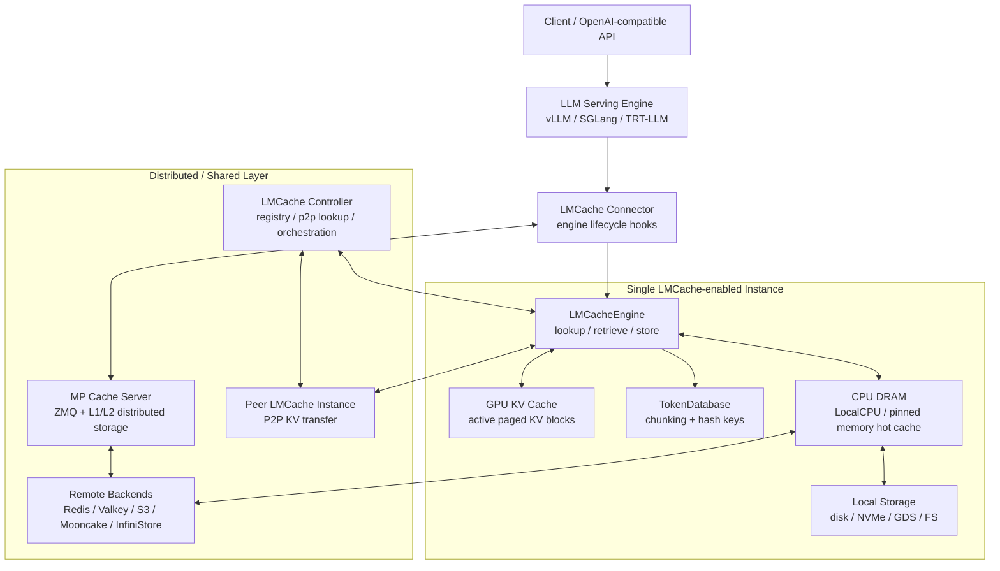
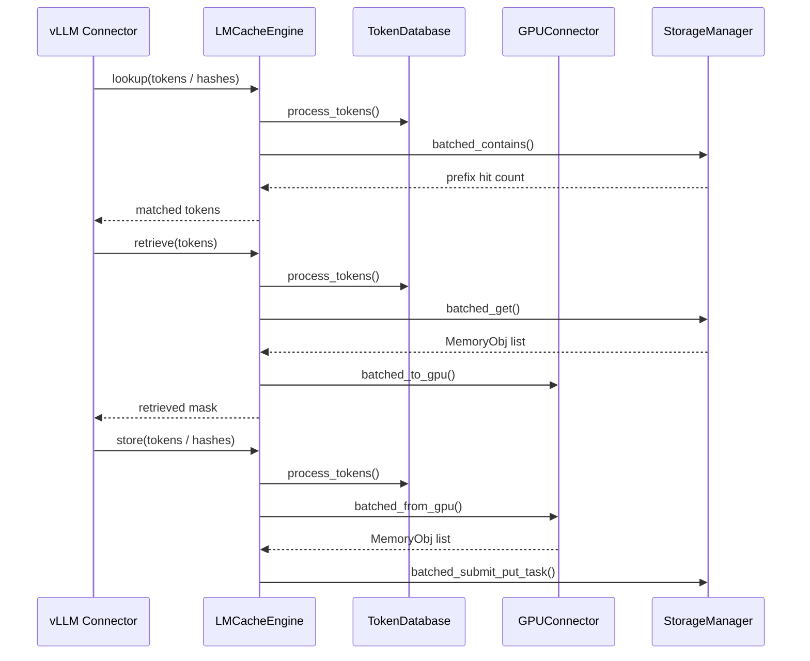
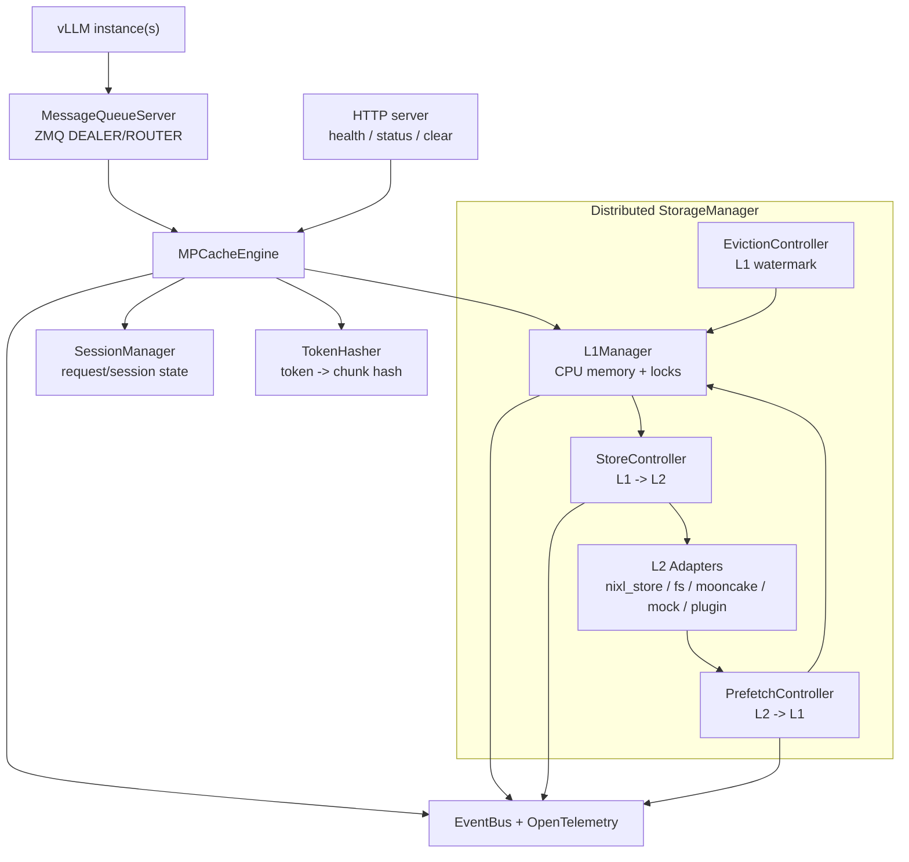
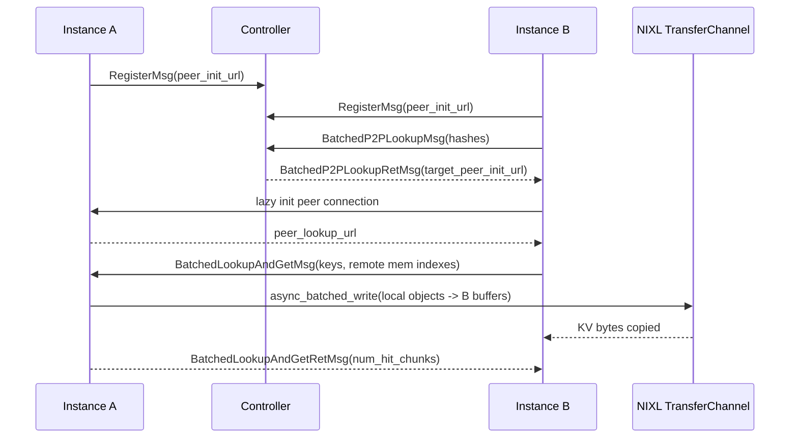

# LMCache v0.4.4 架构文档

本文分析对象是 [LMCache/LMCache](https://github.com/LMCache/LMCache) 的稳定版本 `v0.4.4`。

- PyPI 版本：[lmcache 0.4.4](https://pypi.org/project/lmcache/)，发布时间 `2026-04-23`
- GitHub tag：[v0.4.4](https://github.com/LMCache/LMCache/tree/v0.4.4)
- 源码 commit：[`6fbec463e3c047fffb4e22c97508f03b057de3bc`](https://github.com/LMCache/LMCache/tree/6fbec463e3c047fffb4e22c97508f03b057de3bc)
- CUDA 13 变体：`v0.4.4-cu13`，本文不作为主分析对象

## 1. 项目定位

LMCache 是一个面向 LLM 推理系统的 KV cache 层。它不替代 vLLM、SGLang 这样的推理引擎，而是在推理引擎和存储/传输系统之间增加一层可复用的 KV cache 管理能力。

它要解决的问题是：相同或高度复用的文本片段反复出现在长上下文、RAG、多轮对话、批处理和多实例服务中时，prefill 阶段会重复消耗 GPU 计算。LMCache 把已经计算出的 KV cache 按 chunk 存储、索引、搬运和复用，从而降低 TTFT，并减少 GPU 计算浪费。

从系统视角看，LMCache 是三个东西的组合：

- 引擎集成层：嵌入 vLLM / SGLang / TensorRT-LLM 等推理生命周期，触发 lookup、retrieve、store。
- KV 数据面：负责 GPU、CPU、本地盘、远端后端之间的 cache 字节搬运。
- 控制面：负责 worker 注册、跨实例 lookup、P2P 路由、管理 API、健康检查和观测。

官方 PyPI 描述和 README 都强调一个关键点：LMCache 复用的是 reusable text 的 KV cache，不局限于单个请求内的 prefix cache，也不局限于同一个 serving engine instance。

## 2. 总体架构

LMCache 的核心架构可以概括为：推理引擎通过 connector 进入 LMCache，LMCache 将 KV cache 切成 chunk 后，在 GPU、CPU、本地盘、远端存储或 peer instance 间流动。



这张图里有两条主路径：

- 传统 v1 engine path：`LMCacheEngine` 直接管理 storage backends，适合 CPU / disk / remote backend 组合。
- Multiprocess path：vLLM 通过 ZMQ 连接独立的 MP cache server，由 server 内的 distributed `StorageManager` 管理 L1/L2。

二者共享同一类抽象：chunk key、memory object、异步 I/O、后台 store/prefetch、控制面观测。区别在于进程边界和组件职责划分。

## 3. 多层 KV Cache

LMCache 把 KV cache 看成可分层管理的对象，而不是只存在于推理引擎内部的临时 GPU tensor。

| 层级 | 角色 | 典型实现 | 主要优化目标 |
| --- | --- | --- | --- |
| GPU memory | 当前推理请求使用的 paged KV blocks | vLLM KV cache tensor | 计算和 attention 读取性能 |
| CPU DRAM | 热缓存与搬运缓冲 | `LocalCPUBackend`、pinned memory | GPU↔CPU 低开销搬运、快速复用 |
| Local storage | 大容量本地层 | local disk、NVMe、GDS、FS adapter | 容量、持久化、本机复用 |
| Remote/shared storage | 跨实例共享层 | Redis/Valkey、S3、Mooncake、InfiniStore、NIXL store | 跨实例/跨节点复用 |
| P2P channel | 实时实例间传输 | NIXL transfer channel、socket control plane | 低时延 KV 迁移和 disaggregated serving |

重点设计是：GPU 只保留正在参与计算的工作集；CPU 作为热层和 staging buffer；本地/远端后端承担更大的容量和跨生命周期复用；P2P channel 用于实时传输，不一定要求先落到持久后端。

## 4. 两种核心模式

### 4.1 Storage Mode

Storage Mode 面向 KV cache offloading、持久化和跨请求复用。

典型写路径：

1. vLLM 计算出新的 KV cache。
2. LMCache connector 在请求结束或 layer 保存阶段调用 LMCache。
3. `LMCacheEngine.store()` 将 token/hash 切成 chunk key。
4. GPU connector 把对应 KV 从 GPU 拷贝到 `MemoryObj`。
5. storage manager 将 `MemoryObj` 放入 CPU、本地盘或远端 backend。
6. 慢后端写入通过后台任务执行，避免阻塞推理主路径。

典型读路径：

1. scheduler 或 worker 对 token 序列执行 lookup。
2. LMCache 返回连续 prefix 命中的 token 数。
3. worker 在模型 forward 前 retrieve。
4. 后端把命中的 KV chunk 回载到 CPU/staging memory。
5. GPU connector 将 KV 注入 vLLM 的 paged KV buffer。
6. vLLM 跳过已命中的 prefill 计算，只计算剩余 token。

这个模式最适合长文档、多轮问答、RAG、系统提示词复用和重启后仍希望保留缓存的部署。

### 4.2 Transport Mode

Transport Mode 面向实时 KV 传输，尤其是 prefill/decode disaggregation 和 P2P KV sharing。

在这个模式里，LMCache 更像一个 KV 传输层：

- prefiller 计算 prompt KV。
- decoder 或另一个 serving instance 需要同一段 KV。
- Controller 帮助判断哪个 instance 持有目标 chunk。
- P2P backend 建立 peer 连接。
- NIXL channel 将 KV 从 source peer 的 memory buffer 传到 target peer 的 memory buffer。
- target peer 再把 KV 注入本地 GPU paged KV cache。

这个模式的关键目标不是长期持久化，而是降低跨实例复用时的传输延迟。

## 5. vLLM 集成设计

LMCache v0.4.4 主要通过 vLLM v1 KV connector 接入。关键源码入口：

- [`lmcache/integration/vllm/lmcache_connector_v1.py`](https://github.com/LMCache/LMCache/blob/v0.4.4/lmcache/integration/vllm/lmcache_connector_v1.py)
- [`lmcache/integration/vllm/vllm_v1_adapter.py`](https://github.com/LMCache/LMCache/blob/v0.4.4/lmcache/integration/vllm/vllm_v1_adapter.py)
- [`lmcache/integration/vllm/vllm_service_factory.py`](https://github.com/LMCache/LMCache/blob/v0.4.4/lmcache/integration/vllm/vllm_service_factory.py)

vLLM connector 的职责边界很清楚：

| vLLM 生命周期点 | LMCache 行为 |
| --- | --- |
| scheduler 查询可复用 token | `get_num_new_matched_tokens()` 调用 lookup client 或 engine lookup |
| block allocation 后 | `update_state_after_alloc()` 记录请求后续 load/save 所需状态 |
| worker forward 前 | `start_load_kv()` 准备 retrieve |
| attention layer 内 | `wait_for_layer_load()` 等待 layerwise 异步加载 |
| attention layer 后 | `save_kv_layer()` 保存当前 layer KV |
| 请求结束 | `request_finished()` 触发异步保存或传输 |

`VllmServiceFactory` 负责把 vLLM 的模型配置、parallel 配置、KV dtype、KV shape、worker role 转换成 `LMCacheMetadata`，并按 role 创建 engine、lookup client/server、offload server、internal API server、health monitor。

## 6. LMCacheEngine 核心流程

[`lmcache/v1/cache_engine.py`](https://github.com/LMCache/LMCache/blob/v0.4.4/lmcache/v1/cache_engine.py) 是非 MP 路径的核心类。它将 token/hash、GPU connector、storage manager 和观测指标串起来。



重点设计：

- chunk 粒度由 `chunk_size` 控制，常见配置是 256 tokens。
- lookup 只认可连续 prefix 命中；中间 miss 后，后续 chunk 即使存在也不能直接作为 prefix 命中返回。
- `MemoryObj` 是 CPU/staging 侧的统一数据对象，带 ref count、pin/unpin、metadata。
- health monitor 失败时，engine 会跳过 LMCache 操作，回退到 recompute。
- `save_only_first_rank` 支持只由第一 rank 保存，然后通过 tensor parallel group broadcast 让其他 rank 得到结果。

## 7. Multiprocess Mode

v0.4.0 之后，LMCache 明显向 MP mode 演进。v0.4.4 中 MP mode 已经具备独立 server、ZMQ 协议、L1/L2 storage manager、观测和 HTTP 管理接口。

核心入口：

- [`lmcache/v1/multiprocess/server.py`](https://github.com/LMCache/LMCache/blob/v0.4.4/lmcache/v1/multiprocess/server.py)
- [`lmcache/v1/multiprocess/mq.py`](https://github.com/LMCache/LMCache/blob/v0.4.4/lmcache/v1/multiprocess/mq.py)
- [`lmcache/v1/multiprocess/protocols/base.py`](https://github.com/LMCache/LMCache/blob/v0.4.4/lmcache/v1/multiprocess/protocols/base.py)
- [`lmcache/v1/distributed/storage_manager.py`](https://github.com/LMCache/LMCache/blob/v0.4.4/lmcache/v1/distributed/storage_manager.py)

MP mode 的结构：



MP server 的协议分成同步和阻塞两类：

- SYNC：注册 KV cache、获取 chunk size、debug/noop、清理等轻量操作。
- BLOCKING：store、retrieve、lookup、CacheBlend 相关操作，可能涉及 GPU copy 或 I/O，交给 worker pool。

这个设计把推理进程和 cache server 进程隔开，使 cache 存储、I/O 和观测可以独立扩展，也让 vLLM 侧的 connector 更薄。

## 8. L1/L2 分布式存储设计

MP mode 的分布式存储核心在 [`lmcache/v1/distributed`](https://github.com/LMCache/LMCache/tree/v0.4.4/lmcache/v1/distributed)。

### 8.1 ObjectKey

[`ObjectKey`](https://github.com/LMCache/LMCache/blob/v0.4.4/lmcache/v1/distributed/api.py) 是 MP storage manager 的对象身份：

- `chunk_hash`：token chunk 的内容 hash。
- `model_name`：模型名，避免不同模型 KV 混用。
- `kv_rank`：编码 world size、global rank、local world size、local rank，用于区分并行布局。

它的作用是让同一段文本在不同模型、不同并行切片下不会意外碰撞。

### 8.2 L1Manager

[`L1Manager`](https://github.com/LMCache/LMCache/blob/v0.4.4/lmcache/v1/distributed/l1_manager.py) 管理 CPU memory 中的对象状态。

核心状态机：

```text
None -> write_locked -> ready -> read_locked
        reserve_write    finish_write / reserve_read
```

重点设计：

- 每个对象有 read lock 和 write lock。
- lock 使用 `TTLLock`，防止 client 崩溃后永久占锁。
- `reserve_write()` 是两阶段写入的第一步，先分配可写 buffer。
- `finish_write()` 将对象转为 ready，并通知 store controller。
- `reserve_read()` 增加读锁，避免对象被 eviction 或写覆盖。
- `finish_read()` 释放读锁，临时对象可在读完后删除。

### 8.3 StoreController

[`StoreController`](https://github.com/LMCache/LMCache/blob/v0.4.4/lmcache/v1/distributed/storage_controllers/store_controller.py) 是 L1 到 L2 的异步后台线程。

它监听 L1 write finished 事件，按 store policy 将对象提交给 L2 adapters。它不在 L1Manager 锁内做慢 I/O，而是通过 eventfd + `select.poll()` 处理完成事件。

### 8.4 PrefetchController

[`PrefetchController`](https://github.com/LMCache/LMCache/blob/v0.4.4/lmcache/v1/distributed/storage_controllers/prefetch_controller.py) 是 L2 到 L1 的异步预取线程。

典型流程：

1. `StorageManager.submit_prefetch_task()` 先检查 L1 prefix hit。
2. 对 L1 miss 的剩余 keys，提交 L2 lookup-and-lock。
3. 多个 L2 adapter 返回 bitmap。
4. prefetch policy 决定从哪个 adapter load。
5. controller 为命中 keys reserve L1 write buffer。
6. adapter load 数据到 L1 buffer。
7. L1 对象从 write lock 转成 read lock。
8. `query_prefetch_status()` 返回总命中 chunk 数。

这里的“只取连续 prefix”非常关键：即使后面 chunk 命中，只要前面存在缺口，也不能跳过前面的 prefill。

### 8.5 EvictionController

[`EvictionController`](https://github.com/LMCache/LMCache/blob/v0.4.4/lmcache/v1/distributed/storage_controllers/eviction_controller.py) 根据 L1 memory watermark 触发淘汰。v0.4.4 中 L1 主要支持 LRU / noop 等策略，目标是让内存使用率回落到安全范围，同时不破坏正在读写的对象。

## 9. L2 Adapter 非阻塞模型

[`L2AdapterInterface`](https://github.com/LMCache/LMCache/blob/v0.4.4/lmcache/v1/distributed/l2_adapters/base.py) 定义了 MP mode 的 L2 I/O 合约。

它不是同步 `get/put` 接口，而是三类非阻塞任务：

| 操作 | 提交方法 | 完成查询 | 语义 |
| --- | --- | --- | --- |
| Store | `submit_store_task(keys, objects)` | `pop_completed_store_tasks()` | L1 -> L2 |
| Lookup + lock | `submit_lookup_and_lock_task(keys)` | `query_lookup_and_lock_result(task_id)` | 判断 L2 是否有对象，并防止 load 前被淘汰 |
| Load | `submit_load_task(keys, objects)` | `query_load_result(task_id)` | L2 -> L1 caller-provided buffers |

每类操作都有独立 event fd。StoreController 和 PrefetchController 使用这些 fd 做事件驱动调度，避免用 busy loop 轮询。

v0.4.4 中重要 L2 adapter 包括：

- `nixl_store`：面向 POSIX、GDS、GDS_MT、HF3FS、OBJ 的 NIXL 后端。
- `nixl_store_dynamic`：动态打开/register 文件，支持 persist/recover。
- `fs`：基于 aiofiles 的纯文件系统 adapter。
- `mooncake_store`：Mooncake native connector。
- `mock`：测试用模拟 adapter。
- `plugin`、`native_plugin`、`fs_native`、`resp` 等扩展型 adapter。

多个 adapter 可以级联配置。默认 store policy 会把数据写入所有 adapter；默认 prefetch policy 会从第一个命中的 adapter 加载。

## 10. Controller 与 P2P 分布式设计

LMCache Controller 的源码在 [`lmcache/v1/cache_controller`](https://github.com/LMCache/LMCache/tree/v0.4.4/lmcache/v1/cache_controller)。

### 10.1 Controller 管理平面

核心类：

- [`LMCacheControllerManager`](https://github.com/LMCache/LMCache/blob/v0.4.4/lmcache/v1/cache_controller/controller_manager.py)
- [`RegistrationController`](https://github.com/LMCache/LMCache/blob/v0.4.4/lmcache/v1/cache_controller/controllers/registration_controller.py)
- [`KVController`](https://github.com/LMCache/LMCache/blob/v0.4.4/lmcache/v1/cache_controller/controllers/kv_controller.py)
- [`LMCacheWorker`](https://github.com/LMCache/LMCache/blob/v0.4.4/lmcache/v1/cache_controller/worker.py)

Controller 维护一个 registry tree：

- instance id
- worker id
- worker ip/port
- worker heartbeat
- peer init URL
- worker 持有的 KV chunk hash 集合

worker 向 controller 注册后，会持续上报 heartbeat 和 KV admit/evict 事件。Controller 负责回答“某个 chunk 在哪个 worker/instance 上”，并将 clear、pin、move、compress、decompress 等编排命令下发到 worker。

### 10.2 Full Sync

Full sync 用于 controller 重启、worker 重注册或 registry 可能不完整时恢复全量 KV 索引。

流程：

1. worker 发送 `FullSyncStartMsg`，声明 total keys 和 batch count。
2. controller 标记该 worker 进入 syncing 状态，并清理该 worker 旧索引。
3. worker 发送多个 `FullSyncBatchMsg`。
4. controller 将 batch 中的 key 批量写入 registry。
5. worker 发送 `FullSyncEndMsg`。
6. controller 通过 `FullSyncTracker` 判断完成度和缺失 batch。

Full sync 期间，增量 KV operation 会被丢弃，避免旧索引和新全量快照交错污染。

### 10.3 P2P KV Sharing

P2P backend 在 [`lmcache/v1/storage_backend/p2p_backend.py`](https://github.com/LMCache/LMCache/blob/v0.4.4/lmcache/v1/storage_backend/p2p_backend.py)。



重点设计：

- Controller 只做元数据路由，不搬运 KV bytes。
- 真实 KV bytes 通过 peer transfer channel 直接传输。
- `P2PBackend.batched_async_contains()` 先问 controller，得到 source peer。
- `batched_get_non_blocking()` 在 target 侧分配 local memory objects，并把内存 index 发给 source。
- source 侧 `_handle_batched_lookup_and_get()` 从本地 CPU backend 取出命中 objects，通过 NIXL 写到 target buffers。
- target 侧将收到的 objects pin 住，后续由 engine 注入 GPU。

这个设计避免了中心化 cache server 成为数据面瓶颈；controller 是控制面，peer channel 是数据面。

## 11. 观测、健康检查与运维接口

LMCache v0.4.4 已经有较完整的观测链路。

MP mode 的观测核心：

- [`mp_observability/event_bus.py`](https://github.com/LMCache/LMCache/blob/v0.4.4/lmcache/v1/mp_observability/event_bus.py)
- [`mp_observability/event.py`](https://github.com/LMCache/LMCache/blob/v0.4.4/lmcache/v1/mp_observability/event.py)
- [`mp_observability/otel_init.py`](https://github.com/LMCache/LMCache/blob/v0.4.4/lmcache/v1/mp_observability/otel_init.py)
- [`mp_observability/subscribers`](https://github.com/LMCache/LMCache/tree/v0.4.4/lmcache/v1/mp_observability/subscribers)

设计要点：

- EventBus 是 bounded queue，溢出时 tail-drop，避免观测系统拖垮数据面。
- subscribers 分 metrics、logging、tracing 三类。
- OpenTelemetry provider 在 subscriber 初始化前配置。
- metrics 可暴露到 Prometheus endpoint，也可发到 OTLP collector。
- health monitor 让 LMCache 初始化失败或后端异常时回退到 recompute，而不是让推理服务直接不可用。

HTTP 和 internal API 负责：

- health check
- status report
- clear cache
- backend management
- hot cache/freeze/bypass
- vLLM cache management APIs
- controller worker info / key stats

## 12. 重点设计总结

| 设计点 | 解决的问题 | 关键实现 |
| --- | --- | --- |
| token chunk + hash | 把任意长 token 序列变成可索引 KV chunk | `TokenDatabase`、`TokenHasher`、`ObjectKey` |
| `MemoryObj` | 统一 CPU/staging KV 对象生命周期 | ref count、pin/unpin、metadata |
| 异步 store | 不让慢后端写入阻塞推理 | storage manager、job executor、StoreController |
| 异步 retrieve/prefetch | 在 forward 前或过程中提前加载 KV | async loading、PrefetchController、layerwise load |
| L1 read/write lock | 防止并发读写和淘汰破坏对象 | `L1Manager`、`TTLLock` |
| L2 非阻塞 adapter | 解耦 I/O 后端和调度线程 | event fd、task id、bitmap result |
| MP cache server | 将 cache I/O 从推理进程剥离 | ZMQ、`MPCacheEngine`、distributed `StorageManager` |
| Controller registry | 跨实例知道 key 在哪里 | `RegistrationController`、`KVController` |
| P2P/NIXL | 避免中心化数据转发瓶颈 | `P2PBackend`、transfer channel |
| Full sync | controller/worker 状态恢复 | `FullSyncTracker`、batch sync messages |
| EventBus/OTel | 可观测且不阻塞数据面 | bounded queue、subscriber 模型 |

## 13. 参考资料

- [PyPI: lmcache 0.4.4](https://pypi.org/project/lmcache/)
- [GitHub: LMCache v0.4.4 tag](https://github.com/LMCache/LMCache/tree/v0.4.4)
- [Architecture Overview](https://github.com/LMCache/LMCache/blob/v0.4.4/docs/source/developer_guide/architecture.rst)
- [MP Architecture](https://github.com/LMCache/LMCache/blob/v0.4.4/docs/source/mp/architecture.rst)
- [MP L2 Storage](https://github.com/LMCache/LMCache/blob/v0.4.4/docs/source/mp/l2_storage.rst)
- [P2P KV Cache Sharing](https://github.com/LMCache/LMCache/blob/v0.4.4/docs/source/kv_cache/p2p_sharing.rst)
